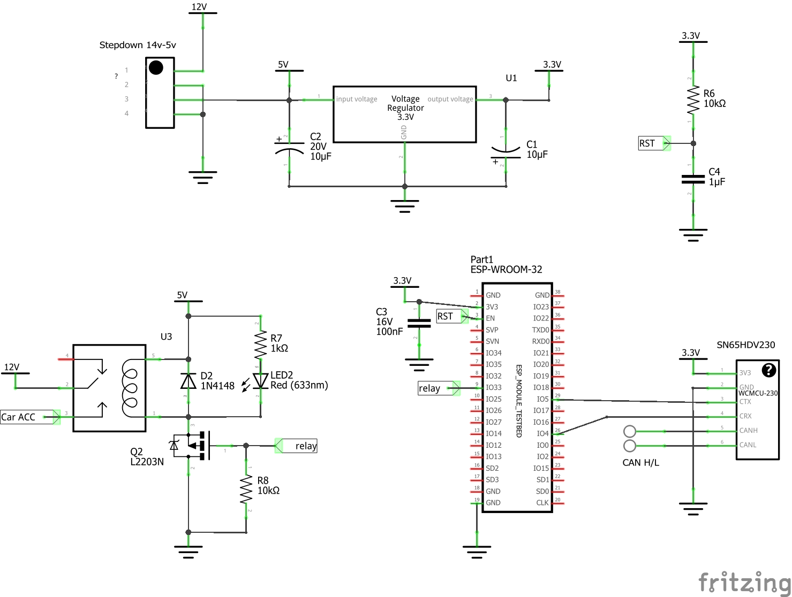

# CarCanPower

In modern cars, power for accessories isn't regulated by turning the voltage off, but instead of it a CAN message with sleep is broadcasted to all devices. To not discharge the car battery too deeply when connecting external devices like for example a Bluetooth adapter or Raspberry Pi a CAN sniffer was developed.

It reads single type of CAN message which is state of key position in BMW e6x series. If the key is inserted, a gpio output is set to HIGH. This turns on the power for external devices. Removal of a key turns the power back off and protects the car battery from going flat.

## Schematics
